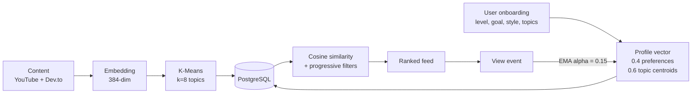

# LearnWise

**An AI-powered learning-content recommendation platform.** Users describe their level, goals and interests once; LearnWise builds a semantic profile vector for them and ranks a corpus of programming videos and articles by cosine similarity — then keeps that vector moving as they actually watch things.

Built as a full-stack Next.js 16 application with a separate Python inference service. Multilingual (Arabic/English) semantic matching, running on quantized transformer weights small enough to fit a free-tier container.

> مشروع تخرّج: منصّة تعليمية بتوصّي كل مستخدم بمحتوى مخصّص باستخدام تمثيلات دلالية (embeddings) وتجميع K-Means.

| | |
|---|---|
| **Live demo** | _to be added after deployment_ |
| **Stack** | Next.js 16 · React 19 · TypeScript · Prisma 7 · PostgreSQL · FastAPI · ONNX Runtime |
| **Corpus** | 189 curated items (YouTube + Dev.to) across 8 auto-discovered topics |

---

## How the recommendation engine works

The core idea: represent both **users** and **content** as vectors in the same 384-dimensional semantic space, then rank by cosine similarity. Everything runs on self-hosted weights — no third-party LLM API.



**1 — Content embedding.** Each item's `title. description` is encoded with [`paraphrase-multilingual-MiniLM-L12-v2`](https://huggingface.co/sentence-transformers/paraphrase-multilingual-MiniLM-L12-v2) into a normalized 384-dim vector. The model is multilingual, so Arabic preferences match English content and vice versa.

**2 — Topic discovery.** K-Means (k=8, chosen by silhouette score) clusters the content vectors into topics. Cluster centroids become the selectable interests shown during onboarding — the topic list is *derived from the corpus*, not hardcoded.

**3 — User profile vector.** On onboarding, the answers become a vector:

```
profile = normalize( 0.4 * embed("level X, goal Y, style Z")
                   + 0.6 * mean(centroids of chosen topics) )
```

**4 — Ranking.** Content is scored by cosine similarity against the user's current vector, then filtered by difficulty level, session length (derived from their weekly time budget) and preferred media type. Filters are relaxed **progressively** — if all three together yield fewer than `limit` results, constraints are dropped one at a time rather than returning an empty feed. Semantic similarity is always the primary signal; filters refine it.

**5 — Adaptation.** Every view nudges the profile vector toward the viewed item with an exponential moving average (alpha = 0.15), so the feed drifts with actual behaviour rather than staying frozen at the onboarding answers.

---

## Architecture

Two deployables, because they have opposite resource profiles: the web app is I/O-bound and benefits from serverless scale-to-zero, while the model server is memory-bound and needs a warm process.

```
┌─────────────────────┐         ┌───────────────────────┐
│  Next.js 16         │  HTTP   │  FastAPI service      │
│  App Router         │────────▶│  /embed  /cluster     │
│  UI · API · auth    │         │  ONNX Runtime         │
│  — Vercel           │         │  — Render             │
└──────────┬──────────┘         └───────────────────────┘
           │ Prisma 7 (Neon serverless driver)
           ▼
    ┌──────────────┐
    │  PostgreSQL  │  users · content · clusters · history
    └──────────────┘
```

### Why ONNX instead of PyTorch

The original service loaded the model through `sentence-transformers`. That works locally but not in a 512 MB container: XLM-R's vocabulary matrix alone (250k tokens × 384 dims) is ~384 MB in fp32, and PyTorch's runtime adds a few hundred MB on top.

Switching to the officially published **int8-quantized ONNX** weights and calling `onnxruntime` directly — with `tokenizers` for tokenization and NumPy for mean pooling — drops resident memory to roughly a third and removes PyTorch from the dependency tree entirely. `scikit-learn` is imported lazily inside `/cluster` for the same reason: it costs ~150 MB at import time and is only needed by the offline clustering job.

Quantization is not free. Measured against the fp32 baseline over the full corpus, individual vectors shift by about 0.93 cosine — but what matters for a recommender is *ranking*, and nearest-neighbour agreement holds at **88% for top-5 and 90% for top-10**. The important consequence is that fp32 and int8 vectors are not interchangeable: every vector in the database — content, cluster centroids, user profiles — is generated by the same model, so the space stays internally consistent.

### Authentication

Session cookies signed with [`jose`](https://github.com/panva/jose) (HS256 JWT), `httpOnly` and `secure` in production, passwords hashed with bcrypt. Separate user and admin session namespaces, with admin routes guarded by a route-group layout.

---

## Features

**For learners**
- Registration and an onboarding questionnaire that produces the semantic profile
- Personalized feed with topic labels, duration and difficulty
- Content detail pages; every view feeds back into the profile vector
- Profile editing (re-runs the vector build), domain suggestions, contact form

**For admins**
- Dashboard with usage statistics
- Full CRUD over the content corpus, with embeddings recomputed on write
- User inspection: profile, cluster memberships, view and login history
- Review queue for user-suggested domains and contact messages

---

## Tech stack

| Layer | Choice |
|---|---|
| Framework | Next.js 16 (App Router, Server Components), React 19 |
| Language | TypeScript (strict) |
| Styling | Tailwind CSS v4 |
| ORM | Prisma 7 with the `@prisma/adapter-neon` driver adapter |
| Database | PostgreSQL (Neon) |
| Inference | FastAPI · ONNX Runtime · `tokenizers` · scikit-learn |
| Model | `paraphrase-multilingual-MiniLM-L12-v2`, int8 ONNX |
| Auth | `jose` (JWT) · bcrypt |

---

## Running locally

**Requirements:** Node.js 20.9+, Python 3.11+, a PostgreSQL database.

```bash
git clone https://github.com/<your-username>/learnwise.git
cd learnwise
npm install
cp .env.example .env      # then fill in DATABASE_URL, DIRECT_URL, SESSION_SECRET
```

**Database**

```bash
npm run db:deploy         # apply migrations
npm run db:seed           # admin account + placeholder topics
```

The app talks to Postgres over Neon's WebSocket driver on port 443 rather than
TCP on 5432 — better suited to serverless (no pooled TCP connection to keep
alive between invocations), and it also works on networks that block 5432.
Prisma's own migration engine still uses TCP, so if port 5432 is blocked on
your network run `npm run db:deploy:http` instead, which applies the same
migration files over HTTPS.

**AI service** — separate terminal; the web app needs it for onboarding.

```bash
cd ai-service
python -m venv venv
source venv/bin/activate          # Windows: venv\Scripts\activate
pip install -r requirements.txt
python download_model.py          # ~120 MB, one time
uvicorn app.main:app --reload --port 8000
```

**Web app**

```bash
npm run dev                       # http://localhost:3000
```

**Populating the corpus** — optional; videos need `YOUTUBE_API_KEY`.

```bash
npm run fetch:content     # pull from YouTube + Dev.to
npm run ai:embed-content  # compute content embeddings
npm run ai:cluster        # K-Means to topics + centroids
```

---

## Deployment

The web app deploys to **Vercel** with no extra configuration — `npm run build` runs `prisma generate` first. The inference service deploys to **Render** via the included [`render.yaml`](render.yaml) blueprint; Render downloads the model weights during the build step, since they exceed GitHub's per-file limit and are not stored in the repo.

Environment variables are documented in [`.env.example`](.env.example).

---

## Project structure

```
app/
  (site)/          public and authenticated user pages
  admin/           admin console (route-group protected)
  api/             route handlers: auth, content, onboarding, admin
lib/
  prisma.ts        Prisma client (pg driver adapter)
  embeddings.ts    AI-service client + vector math
  preferences.ts   profile-vector construction
  recommend.ts     scoring + progressive filtering
  session.ts       JWT session cookies
ai-service/
  app/main.py      FastAPI: /embed, /cluster, /health
  download_model.py   resumable weight downloader
prisma/
  schema.prisma    10 models
  migrations/
scripts/           content ingestion, embedding, clustering, data migration
```

---

## Validation

`scripts/thesis-tests/` holds the scripts used to validate the pipeline — silhouette analysis for choosing *k*, ranking-order verification for the recommender, and API flow tests. Result screenshots are in [`thesis-screenshots/`](thesis-screenshots/).

---

## License

Academic project. Code available for reference and learning.
